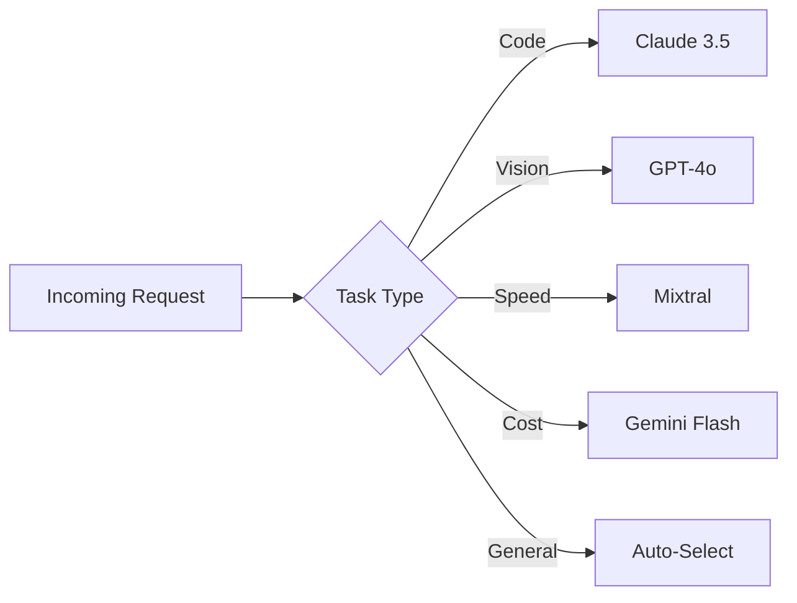
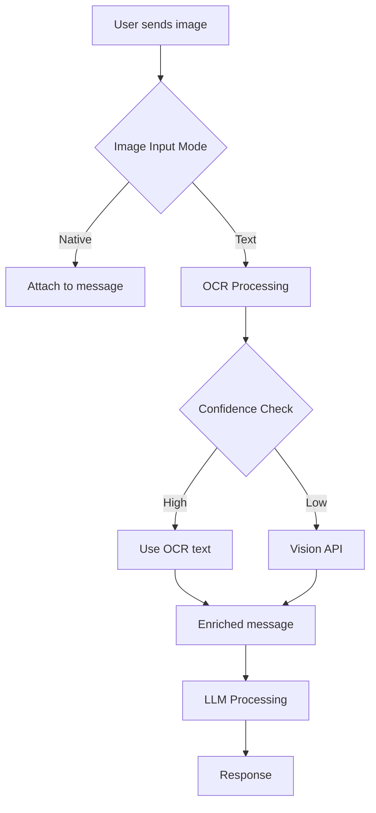

# Architecture Guide

## System Overview

The AI Agent Portfolio is built on a microservices architecture that enables scalable, maintainable, and extensible AI agent deployment.

## Core Components

### 1. Hermes Gateway

The central orchestration layer that handles:
- Message routing across platforms
- Session management
- Model selection and fallback
- Tool execution coordination

```python
class HermesGateway:
    def __init__(self):
        self.platforms = {}
        self.sessions = {}
        self.models = {}
        self.tools = {}
    
    async def process_message(self, message, platform):
        # Route to appropriate handler
        session = self.get_or_create_session(message.user_id)
        model = self.select_model(session.context)
        response = await model.generate(message, session)
        return response
```

### 2. Model Router

Intelligent model selection based on:
- Task complexity
- Cost constraints
- Latency requirements
- Model capabilities



### 3. Tool Registry

Dynamic tool discovery and execution:

```python
class ToolRegistry:
    def __init__(self):
        self.tools = {}
    
    def register(self, name, tool_class):
        self.tools[name] = tool_class
    
    async def execute(self, tool_name, params):
        tool = self.tools[tool_name]
        return await tool.execute(params)
```

### 4. Session Manager

Persistent conversation state with:
- SQLite storage
- Automatic compression
- Context window management
- Memory persistence

## Data Flow

### Message Processing Pipeline

```
1. Platform Adapter receives message
2. Gateway routes to appropriate session
3. Session Manager loads context
4. Model Router selects optimal model
5. Tool Registry provides available tools
6. Model generates response with tool calls
7. Tools execute and return results
8. Model processes tool results
9. Response sent back through platform
```

### Image Processing Flow



## Deployment Architecture

### Production Setup

```
┌─────────────────────────────────────────────┐
│                 Load Balancer               │
└─────────────────────────────────────────────┘
                    │
┌─────────────────────────────────────────────┐
│              Nginx Reverse Proxy            │
└─────────────────────────────────────────────┘
                    │
┌─────────────────────────────────────────────┐
│           PM2 Process Manager               │
│  ┌─────────┐ ┌─────────┐ ┌─────────┐      │
│  │ Gateway │ │ Worker1 │ │ Worker2 │      │
│  └─────────┘ └─────────┘ └─────────┘      │
└─────────────────────────────────────────────┘
                    │
┌─────────────────────────────────────────────┐
│              Application Layer              │
│  ┌─────────┐ ┌─────────┐ ┌─────────┐      │
│  │  Redis  │ │ SQLite  │ │ Files   │      │
│  └─────────┘ └─────────┘ └─────────┘      │
└─────────────────────────────────────────────┘
```

### Scaling Strategy

1. **Horizontal Scaling**
   - Multiple gateway instances
   - Load balancing via Nginx
   - Session affinity for WebSocket

2. **Vertical Scaling**
   - Increase worker threads
   - Optimize memory usage
   - Cache frequent operations

3. **Model Scaling**
   - Multiple API keys per provider
   - Automatic failover
   - Rate limit management

## Security Architecture

### Authentication Flow

```
1. User initiates connection
2. Platform verifies identity (Telegram/Discord)
3. Gateway creates session with unique ID
4. Session token generated
5. All subsequent requests authenticated
```

### Data Protection

- **At Rest:** AES-256 encryption for sensitive data
- **In Transit:** TLS 1.3 for all communications
- **In Memory:** Automatic cleanup of sensitive data
- **Logs:** PII anonymization

## Performance Optimization

### Caching Strategy

| Layer | Technology | TTL | Purpose |
|-------|------------|-----|---------|
| L1 | In-memory | 5min | Hot data |
| L2 | Redis | 1h | Session data |
| L3 | SQLite | 24h | Persistent data |

### Connection Pooling

```python
class ConnectionPool:
    def __init__(self, max_size=10):
        self.pool = asyncio.Queue(maxsize=max_size)
        self.size = 0
    
    async def acquire(self):
        if self.pool.empty() and self.size < self.max_size:
            conn = await self.create_connection()
            self.size += 1
            return conn
        return await self.pool.get()
```

## Monitoring & Observability

### Metrics Collected

- **Request Latency:** P50, P95, P99
- **Token Usage:** Per model, per user
- **Error Rates:** By type, by model
- **Resource Usage:** CPU, memory, disk

### Alerting Rules

| Metric | Threshold | Action |
|--------|-----------|--------|
| Error Rate | >5% | Page on-call |
| Latency P95 | >5s | Scale up |
| Token Usage | >80% quota | Notify |
| Disk Usage | >90% | Cleanup |

## Future Enhancements

1. **Kubernetes Migration**
   - Container orchestration
   - Auto-scaling
   - Service mesh

2. **Multi-Region Deployment**
   - Geographic distribution
   - Latency optimization
   - Disaster recovery

3. **Advanced Model Routing**
   - ML-based model selection
   - Cost optimization algorithms
   - Performance prediction
