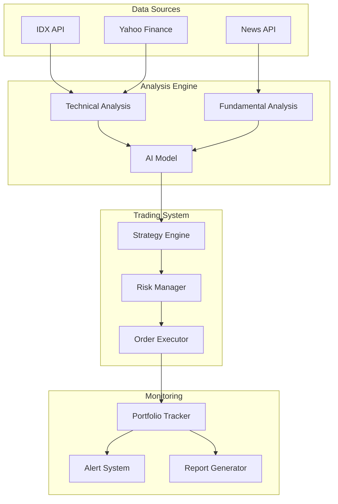

# Trading Bot Example

## Overview

This example demonstrates an AI-powered trading bot for the Indonesian stock market (IDX/BEI) with automated analysis and execution capabilities.

## Features

- **Real-time Market Data** - Live IDX stock prices
- **AI Analysis** - Technical and fundamental analysis
- **Automated Trading** - Buy/sell order execution
- **Risk Management** - Position sizing, stop-loss
- **Portfolio Tracking** - P&L monitoring
- **Alert System** - Price and signal notifications

## Architecture



## Setup

### Prerequisites

```bash
# Install dependencies
pip install pandas numpy ta-lib yfinance

# Configure API keys
export IDX_API_KEY="your_idx_api_key"
export AJAIB_API_KEY="your_ajaib_api_key"
```

### Configuration

Create `config.yaml`:

```yaml
trading:
  mode: simulation  # simulation or live
  capital: 100000000  # IDR
  
  symbols:
    - BBCA
    - BBRI
    - BMRI
    - TLKM
    - ASII
  
  strategy:
    type: momentum
    timeframe: 1d
    indicators:
      - rsi
      - macd
      - bollinger_bands
  
  risk:
    max_position_size: 0.1  # 10% of capital
    stop_loss: 0.05  # 5%
    take_profit: 0.15  # 15%
    max_daily_loss: 0.03  # 3%
```

## Usage

### Manual Trading

```bash
# Get market data
python trading_bot.py --action data --symbol BBCA

# Analyze stock
python trading_bot.py --action analyze --symbol BBCA

# Place order
python trading_bot.py --action order --symbol BBCA --side BUY --quantity 100
```

### Automated Trading

```bash
# Start automated trading
python trading_bot.py --mode auto

# With custom strategy
python trading_bot.py --mode auto --strategy momentum

# Paper trading (simulation)
python trading_bot.py --mode paper
```

## Trading Strategies

### 1. Momentum Strategy

Buy stocks showing upward momentum:

```python
class MomentumStrategy:
    def generate_signal(self, data):
        # Calculate indicators
        rsi = calculate_rsi(data, period=14)
        macd = calculate_macd(data)
        
        # Buy signal
        if rsi < 30 and macd > signal_line:
            return "BUY"
        
        # Sell signal
        if rsi > 70 and macd < signal_line:
            return "SELL"
        
        return "HOLD"
```

### 2. Mean Reversion

Buy oversold, sell overbought:

```python
class MeanReversionStrategy:
    def generate_signal(self, data):
        # Calculate Bollinger Bands
        upper, middle, lower = bollinger_bands(data, period=20)
        
        # Buy when price touches lower band
        if data['close'] <= lower:
            return "BUY"
        
        # Sell when price touches upper band
        if data['close'] >= upper:
            return "SELL"
        
        return "HOLD"
```

### 3. AI-Powered Strategy

Use AI model for prediction:

```python
class AIStrategy:
    def generate_signal(self, data, news):
        # Prepare context
        context = f"""
        Stock: {data['symbol']}
        Price: {data['close']}
        Volume: {data['volume']}
        News: {news}
        """
        
        # Get AI prediction
        response = chat(f"Analyze this stock: {context}")
        
        # Parse response
        if "bullish" in response.lower():
            return "BUY"
        elif "bearish" in response.lower():
            return "SELL"
        
        return "HOLD"
```

## Risk Management

### Position Sizing

```python
def calculate_position_size(capital, risk_per_trade, stop_loss):
    max_loss = capital * risk_per_trade
    position_size = max_loss / stop_loss
    return position_size
```

### Stop-Loss

```python
def calculate_stop_loss(entry_price, risk_pct):
    return entry_price * (1 - risk_pct)
```

### Portfolio Limits

```yaml
risk:
  max_positions: 10
  max_sector_exposure: 0.3  # 30%
  max_single_stock: 0.1  # 10%
  correlation_limit: 0.7
```

## Market Data

### IDX API

```python
import requests

def get_stock_data(symbol, period='1d'):
    url = f"https://api.idx.co.id/v1/stocks/{symbol}"
    params = {'period': period}
    response = requests.get(url, params=params)
    return response.json()
```

### Yahoo Finance

```python
import yfinance as yf

def get_stock_data(symbol):
    stock = yf.Ticker(f"{symbol}.JK")
    data = stock.history(period="1mo")
    return data
```

## Technical Indicators

### RSI (Relative Strength Index)

```python
def calculate_rsi(data, period=14):
    delta = data['close'].diff()
    gain = (delta.where(delta > 0, 0)).rolling(window=period).mean()
    loss = (-delta.where(delta < 0, 0)).rolling(window=period).mean()
    rs = gain / loss
    rsi = 100 - (100 / (1 + rs))
    return rsi
```

### MACD

```python
def calculate_macd(data, fast=12, slow=26, signal=9):
    exp1 = data['close'].ewm(span=fast).mean()
    exp2 = data['close'].ewm(span=slow).mean()
    macd = exp1 - exp2
    signal_line = macd.ewm(span=signal).mean()
    return macd, signal_line
```

### Bollinger Bands

```python
def bollinger_bands(data, period=20, std_dev=2):
    middle = data['close'].rolling(window=period).mean()
    std = data['close'].rolling(window=period).std()
    upper = middle + (std * std_dev)
    lower = middle - (std * std_dev)
    return upper, middle, lower
```

## Backtesting

### Run Backtest

```bash
# Backtest with historical data
python trading_bot.py --backtest --start 2025-01-01 --end 2026-05-22

# With custom strategy
python trading_bot.py --backtest --strategy momentum --capital 100000000
```

### Results Analysis

```python
def analyze_backtest(results):
    total_return = results['final_capital'] / results['initial_capital'] - 1
    sharpe_ratio = calculate_sharpe_ratio(results['returns'])
    max_drawdown = calculate_max_drawdown(results['equity_curve'])
    
    print(f"Total Return: {total_return:.2%}")
    print(f"Sharpe Ratio: {sharpe_ratio:.2f}")
    print(f"Max Drawdown: {max_drawdown:.2%}")
```

## Monitoring

### Portfolio Dashboard

```bash
# View portfolio status
python trading_bot.py --portfolio

# View P&L
python trading_bot.py --pnl

# View trade history
python trading_bot.py --history
```

### Alerts

```yaml
alerts:
  price:
    - symbol: BBCA
      condition: "> 10000"
      action: notify
  
  signal:
    - strategy: momentum
      signal: BUY
      action: execute
  
  risk:
    - condition: daily_loss > 3%
      action: stop_trading
```

## Example Output

### Daily Report

```
=== Trading Bot Daily Report ===
Date: 2026-05-22

Portfolio Summary:
- Total Value: Rp 105,250,000
- Cash: Rp 25,000,000
- Positions: 5 stocks
- Daily P&L: +Rp 1,250,000 (+1.2%)
- Total P&L: +Rp 5,250,000 (+5.25%)

Positions:
1. BBCA: 1000 shares @ Rp 9,500 = Rp 9,500,000 (+2.1%)
2. BBRI: 500 shares @ Rp 5,200 = Rp 2,600,000 (+1.5%)
3. BMRI: 300 shares @ Rp 7,800 = Rp 2,340,000 (+0.8%)
4. TLKM: 200 shares @ Rp 3,100 = Rp 620,000 (+3.2%)
5. ASII: 150 shares @ Rp 6,500 = Rp 975,000 (-0.5%)

Today's Trades:
1. BUY 100 BBCA @ Rp 9,500
2. SELL 50 BBRI @ Rp 5,200

AI Analysis:
- Market sentiment: Bullish
- Recommended sectors: Banking, Telecom
- Risk level: Medium
```

## Deployment

### Production Setup

```bash
# Install PM2
npm install -g pm2

# Create ecosystem file
cat > ecosystem.config.js << EOF
module.exports = {
  apps: [{
    name: 'trading-bot',
    script: 'python',
    args: 'trading_bot.py --mode auto',
    cron_restart: '0 9 * * 1-5',  // Restart Mon-Fri at 9 AM
    env: {
      TRADING_MODE: 'live',
      CAPITAL: '100000000'
    }
  }]
};
EOF

# Start with PM2
pm2 start ecosystem.config.js
```

### Monitoring

```bash
# Check status
pm2 status trading-bot

# View logs
pm2 logs trading-bot

# Monitor resources
pm2 monit
```

## Disclaimer

⚠️ **This is for educational purposes only!**

- Trading involves risk of financial loss
- Past performance doesn't guarantee future results
- Always do your own research
- Never invest more than you can afford to lose
- Consider consulting a financial advisor
