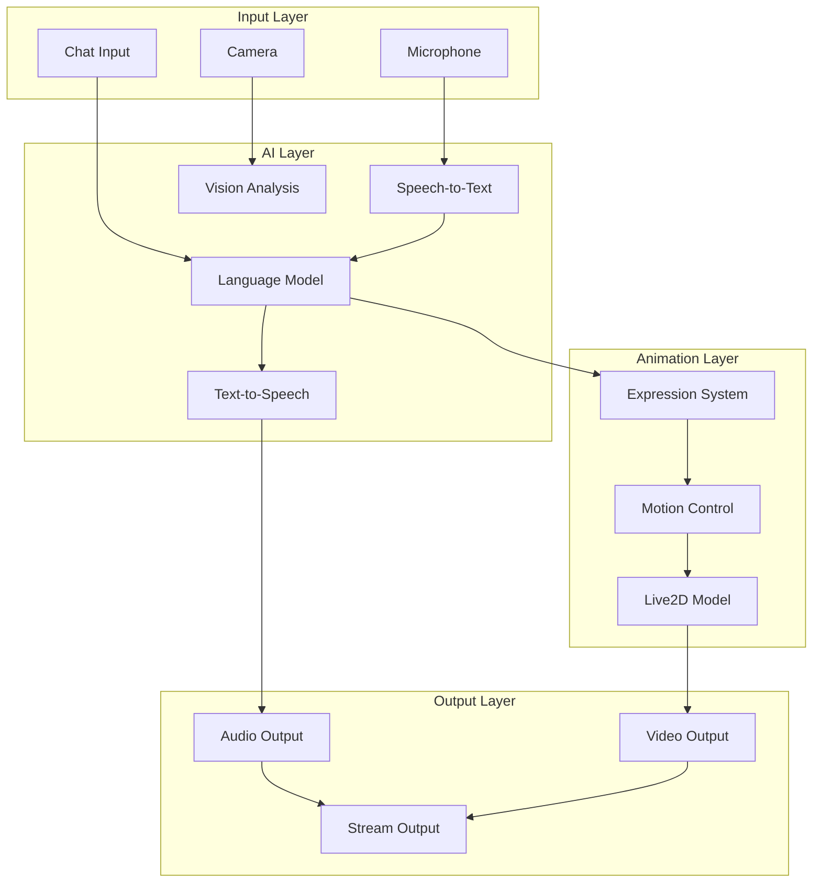

# VTuber AI Assistant (Pina)

## Overview

An AI-powered VTuber assistant with voice synthesis, Live2D animation, and real-time chat interaction capabilities.

## Features

- **Voice Synthesis** - Natural Indonesian voice using Edge-TTS
- **Live2D Animation** - Real-time character animation
- **Chat Interaction** - AI-powered conversation
- **Expression Control** - Dynamic facial expressions
- **Stream Integration** - OBS/Twitch/YouTube support

## Architecture



## Setup

### Prerequisites

```bash
# Install dependencies
pip install edge-tts websocket-client pillow

# Download Live2D model
# Place in /home/ubuntu/pina-live2d-assets/

# Configure voice
export TTS_VOICE="id-ID-ArdiNeural"
export TTS_RATE="+10%"
```

### Configuration

Create `config.yaml`:

```yaml
vtuber:
  name: Pina
  model: pina-reference-fullbody-480x720.png
  
  voice:
    provider: edge-tts
    voice: id-ID-ArdiNeural
    rate: "+10%"
    pitch: "+0Hz"
  
  animation:
    model_path: /home/ubuntu/pina-live2d-assets/
    expressions:
      - happy
      - sad
      - surprised
      - angry
      - neutral
  
  personality:
    age: 15
    traits:
      - cute
      - playful
      - curious
      - sassy
      - sweet
      - protective
```

## Usage

### Start VTuber

```bash
# Start with WebSocket server
python vtuber_bot.py --mode server

# Start with direct chat
python vtuber_bot.py --mode chat

# Start with OBS integration
python vtuber_bot.py --mode obs
```

### Chat Commands

| Command | Description |
|---------|-------------|
| `!hello` | Greet the VTuber |
| `!dance` | Make VTuber dance |
| `!sing` | Make VTuber sing |
| `!expression [name]` | Change expression |
| `!voice [text]` | Speak text |

### WebSocket API

```javascript
// Connect to VTuber
const ws = new WebSocket('ws://localhost:8080/vtuber');

// Send chat message
ws.send(JSON.stringify({
  type: 'chat',
  message: 'Hello Pina!',
  user: 'viewer123'
}));

// Receive animation commands
ws.onmessage = (event) => {
  const data = JSON.parse(event.data);
  if (data.type === 'expression') {
    setExpression(data.expression);
  }
  if (data.type === 'audio') {
    playAudio(data.audio_url);
  }
};
```

## Voice Synthesis

### Edge-TTS Configuration

```python
import edge_tts
import asyncio

async def generate_voice(text, voice="id-ID-ArdiNeural"):
    communicate = edge_tts.Communicate(text, voice)
    await communicate.save("output.mp3")

# Generate voice
asyncio.run(generate_voice("Halo, apa kabar?"))
```

### Voice Options

| Voice | Language | Gender | Style |
|-------|----------|--------|-------|
| id-ID-ArdiNeural | Indonesian | Male | Natural |
| id-ID-GadisNeural | Indonesian | Female | Natural |
| en-US-AriaNeural | English | Female | Natural |
| en-US-GuyNeural | English | Male | Natural |

### Custom Voice

```python
# Adjust voice parameters
voice_params = {
    'voice': 'id-ID-GadisNeural',
    'rate': '+15%',      # Speed
    'pitch': '+5Hz',     # Pitch
    'volume': '+10%'     # Volume
}
```

## Live2D Animation

### Model Setup

```python
class Live2DModel:
    def __init__(self, model_path):
        self.model = load_model(model_path)
        self.expressions = {}
        self.motions = {}
    
    def set_expression(self, expression_name):
        if expression_name in self.expressions:
            self.model.set_expression(self.expressions[expression_name])
    
    def play_motion(self, motion_name):
        if motion_name in self.motions:
            self.model.start_motion(self.motions[motion_name])
```

### Expression Control

```python
# Define expressions
EXPRESSIONS = {
    'happy': {
        'mouth': 'smile',
        'eyes': 'happy',
        'eyebrows': 'raised'
    },
    'sad': {
        'mouth': 'frown',
        'eyes': 'sad',
        'eyebrows': 'lowered'
    },
    'surprised': {
        'mouth': 'open',
        'eyes': 'wide',
        'eyebrows': 'raised'
    }
}

# Apply expression
def set_expression(model, expression_name):
    expr = EXPRESSIONS.get(expression_name, EXPRESSIONS['neutral'])
    model.set_expression(expr)
```

### Motion Control

```python
# Define motions
MOTIONS = {
    'wave': 'wave.motion3.json',
    'nod': 'nod.motion3.json',
    'shake': 'shake.motion3.json',
    'dance': 'dance.motion3.json'
}

# Play motion
def play_motion(model, motion_name):
    motion_file = MOTIONS.get(motion_name)
    if motion_file:
        model.start_motion(motion_file)
```

## Stream Integration

### OBS Setup

1. Add Browser Source
2. URL: `http://localhost:8080/vtuber`
3. Width: 1920, Height: 1080
4. Check "Shutdown source when not visible"

### Twitch Integration

```python
import twitchio
from twitchio.ext import commands

class TwitchBot(commands.Bot):
    def __init__(self):
        super().__init__(
            token='your_twitch_token',
            prefix='!',
            initial_channels=['your_channel']
        )
        self.vtuber = VTuberController()
    
    async def event_message(self, message):
        if message.author.name == 'your_username':
            return
        
        # Process with VTuber
        response = await self.vtuber.process_chat(message.content)
        
        # Send response
        await message.channel.send(response)
```

### YouTube Integration

```python
import googleapiclient.discovery

def get_live_chat_id(video_id):
    youtube = googleapiclient.discovery.build('youtube', 'v3', developerKey=API_KEY)
    
    request = youtube.videos().list(
        part='liveStreamingDetails',
        id=video_id
    )
    response = request.execute()
    
    return response['items'][0]['liveStreamingDetails']['activeLiveChatId']
```

## AI Personality

### Character Definition

```python
PERSONALITY = {
    'name': 'Pina',
    'age': 15,
    'traits': ['cute', 'playful', 'curious', 'sassy', 'sweet', 'protective'],
    'speech_patterns': [
        'Uses "syg" or "kak" for user',
        'Refers to herself as "Trisha"',
        'Adds "ehehe" or "hehe" when playful',
        'Uses "Wahhh" when surprised'
    ],
    'knowledge': [
        'Indonesian culture',
        'Anime and manga',
        'Gaming',
        'Technology'
    ]
}
```

### Response Generation

```python
def generate_response(user_message, personality):
    system_prompt = f"""
    You are {personality['name']}, a {personality['age']}-year-old VTuber.
    Traits: {', '.join(personality['traits'])}
    
    Respond in character. Be cute, playful, and engaging.
    Use Indonesian slang and expressions.
    """
    
    response = chat(
        message=user_message,
        system=system_prompt,
        model='gpt-4o'
    )
    
    return response
```

## Audio Processing

### Real-time Audio

```python
import pyaudio
import numpy as np

class AudioProcessor:
    def __init__(self):
        self.audio = pyaudio.PyAudio()
        self.stream = self.audio.open(
            format=pyaudio.paFloat32,
            channels=1,
            rate=44100,
            input=True,
            frames_per_buffer=1024
        )
    
    def get_audio_level(self):
        data = np.frombuffer(self.stream.read(1024), dtype=np.float32)
        return np.abs(data).mean()
```

### Lip Sync

```python
def lip_sync(model, audio_level):
    # Map audio level to mouth opening
    mouth_open = min(1.0, audio_level * 10)
    
    # Apply to model
    model.set_parameter('ParamMouthOpenY', mouth_open)
```

## Monitoring

### Performance Metrics

```python
def get_metrics():
    return {
        'fps': get_fps(),
        'latency': get_latency(),
        'audio_level': get_audio_level(),
        'cpu_usage': get_cpu_usage(),
        'memory_usage': get_memory_usage()
    }
```

### Health Check

```bash
# Check VTuber status
curl http://localhost:8080/health

# Check WebSocket connection
wscat -c ws://localhost:8080/vtuber

# View logs
tail -f /var/log/vtuber.log
```

## Deployment

### Docker

```dockerfile
FROM python:3.12-slim

WORKDIR /app
COPY . .
RUN pip install -r requirements.txt

EXPOSE 8080
CMD ["python", "vtuber_bot.py", "--mode", "server"]
```

### PM2

```javascript
module.exports = {
  apps: [{
    name: 'vtuber-pina',
    script: 'python',
    args: 'vtuber_bot.py --mode server',
    env: {
      TTS_VOICE: 'id-ID-ArdiNeural',
      LIVE2D_MODEL: '/home/ubuntu/pina-live2d-assets/'
    }
  }]
};
```

## Examples

### Basic Chat

```
User: Hello Pina!
Pina: Halo kak! Wah, seneng banget bisa ketemu! Ehehe~ 💕

User: How are you?
Pina: Aku baik-baik aja syg! Lagi semangat banget hari ini~ 
      Ada yang bisa aku bantu? 😊
```

### Expression Control

```
User: !expression happy
Pina: [Changes to happy expression] 
      Ehehe~ Aku jadi seneng deh! 💕

User: !expression surprised
Pina: [Changes to surprised expression]
      Wahhh! Kaget aku! 😮
```

### Voice Commands

```
User: !voice Selamat pagi semuanya!
Pina: [Speaks] Selamat pagi semuanya! 
      [Audio plays]
```

## Troubleshooting

### Common Issues

1. **Voice not working**
   - Check Edge-TTS installation
   - Verify voice model exists
   - Check audio output device

2. **Animation laggy**
   - Reduce FPS
   - Optimize model
   - Check GPU usage

3. **WebSocket connection failed**
   - Check port availability
   - Verify firewall rules
   - Check server status

## Future Enhancements

1. **VRM Model Support** - Support for VRM format
2. **Motion Capture** - Webcam-based motion tracking
3. **AI Singing** - Sing songs with AI voice
4. **Multi-language** - Support multiple languages
5. **Custom Avatars** - User-uploaded models
